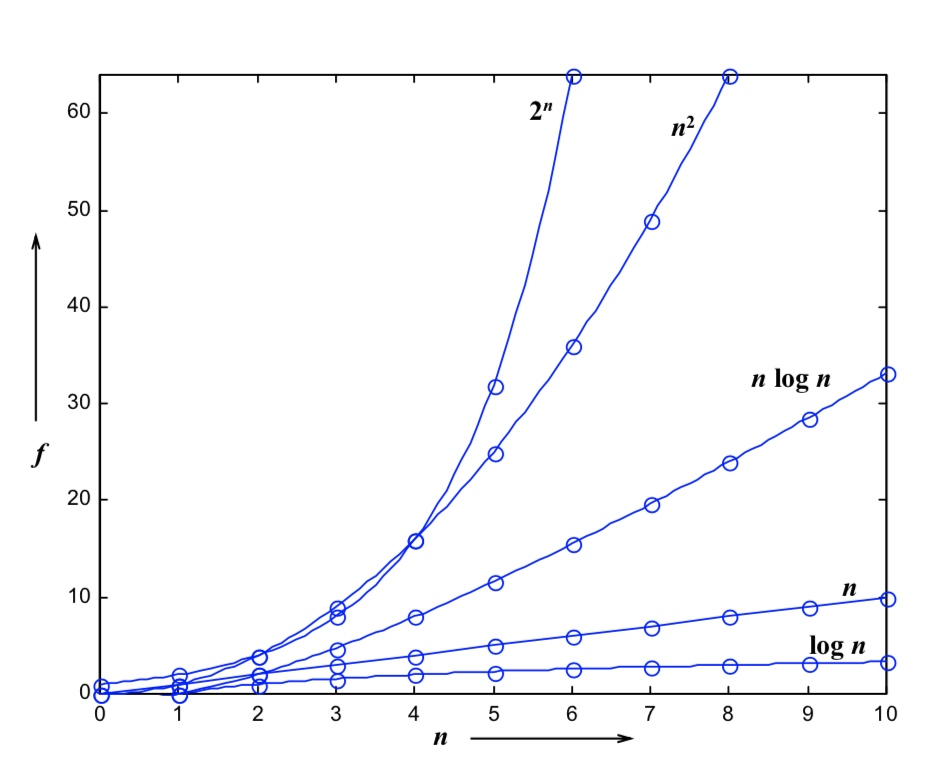

大学时学习的数据结构课程,只剩下零星的记忆,在工作中用到时候,对一些概念定义总是似曾相识却又不甚透彻,所以决心重新系统的学习一下数据结构与算法这门课程.
本系列文章是我在学习**中国大学MOOC网中浙江大学陈越、何钦铭老师的《数据结构》**这门课程的学习笔记.

# 数据结构
> “数据结构(data structure)是计算机中存储、组织
数据的方式。”-中文维基百科

解决问题方法的效率,和数据的组织方式有关.
解决问题方法的效率,和空间的利用效率有关.
解决问题方法的效率,和算法的巧妙程度有关.

## 算法
### 空间复杂图S(n)
根据算法写成的程序在执行时占用存储单元的长度.这个长度往往与输入数据的规模有关.空间复杂度过高的算法可能导致使用的内存超限,造成程序的异常中断.
### 时间复杂度T(n)
根据算法写成的程序在执行时耗费时间的长度.这个长度往往与输入数据的规模有关.时间复杂度过高的低效算法可能需要很久也等不到运行结果.


### 复杂度分析
* 若两段算法分别有复杂度T1(n) = O(f1(n)) 和T2(n) = O(f2(n))，则
    * T1(n) + T2(n) = max( O(f1(n)), O(f2(n)) )
    * T1(n)  T2(n) = O( f1(n)  f2(n) )
* 若T(n)是关于n的k阶多项式，那么T(n)=Θ(nk)
* 一个for循环的时间复杂度等于循环次数乘以循环体
代码的复杂度
* 一个for循环的时间复杂度等于循环次数乘以循环体
代码的复杂度

## 最大子列和问题
给定N个整数的序列{ A1, A2, ..., AN},求最大连续子列的和

```
func SublistMaxSum(list:[Int])->Int {
    var sum = 0, max = 0
    for item in list {
        sum += item;
        if sum > max {
            max = sum
        }
        else if sum < 0 {
            sum = 0
        }
    }
    return max
}
```